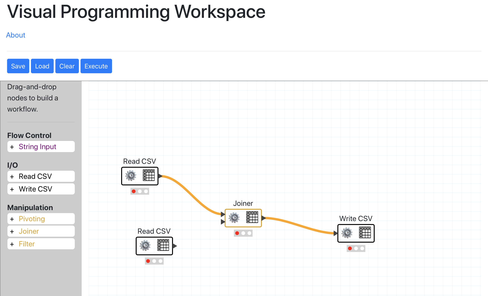

# Introduction

So far the app comprises a Django app and a SPA React app (bootstrapped with
create-react-app). For React to request data from Django, the `proxy` field is
set in `front-end/package.json`, telling the dev server to fetch non-static
data from `localhost:8000` **where the Django app must be running**.

## Django

### Install Dependencies
1. Install `pipenv` from home directory

    - **Homebrew**:

        - `brew install pipenv`

    - **pip**:

        - `pip install pipenv`
        - or depending on your versioning setup:
        - `pip3 install pipenv`

        - You can install at the User level using **pip** via: `pip install --user pipenv`

2. `cd` to top level of project (contains `Pipfile` and `Pipefile.lock`)

3. Install dependencies

    - `pipenv install`

4. Activate and exit the shell

    - `pipenv shell`
    - `exit`

5. Or, run single commands

    - `pipenv run python [COMMAND]`

### Installing new packages
- Simply install via: `pipenv install [package-name]`

### Create dotenv file with app secret
- `echo "SECRET_KEY='TEMPORARY SECRET KEY'" > vp/.environment`

### Start dev server from app root
- `cd vp`
- `pipenv run python manage.py runserver`

---
## React

### Install Prerequisites
- `cd front-end`
- `npm install`

### Start dev server
- `npm start`

---
## CLI
1. Run pipenv shell.
2. Create a workflow using UI and save it.
3. Run it as: pyworkflow execute workflow-file

Also accepts reading input from std (i.e < file.csv) and writing to sdt out (i.e > output.csv)

---
## Tests
PyWorkflow currently has two sets of tests: API endpoints and unit tests.
The API tests are written in Postman and can be run individually, by importing
the collection and environment into your Postman application, or via the command
line by [installing Newman](https://www.npmjs.com/package/newman) and running:

- `cd Postman`
- `newman run PyWorkflow-runner.postman_collection.json --environment Local-env.postman_environment.json`

Unit tests for the PyWorkflow package are run using Python's built-in `unittest`
package.

- `cd pyworkflow/pyworkflow`
- `pipenv run python3 -m unittest tests/*.py`

To see coverage, you can use the `coverage` package. This is included in the Pipfile
but must be installed with `pipenv install -dev`. Then, while still in the pyworkflow
directory, you can run

- `coverage run -m unittest tests/*.py`
- `coverage report` (to see a report via the CLI)
- `coverage html && open /htmlcov/index.html` (to view interactive coverage)

---
## Docker
The Docker container for PyWorkflow is built from 2 images: the `front-end` and the `back-end`. The `docker-compose.yml` defines how to combine and run the two.

In order to build each image individually, from the root of the application:
- `docker build front-end --tag FE_IMAGE[:TAG]`
- `docker build back-end --tag BE_IMAGE[:TAG]`
  ex. - `docker build back-end --tag backendtest:2.0`

Each individual image can be run by changing to the `front-end` or `back-end` directory and running:
- `docker run -p 3000:3000 --name FE_CONTAINER_NAME FE_IMAGE[:TAG]`
- `docker run -p 8000:8000 --name BE_CONTAINER_NAME BE_IMAGE[:TAG]`
  ex. - `docker run -p 8000:8000 --name pyworkflow-be backendtest:2.0`

To compose and run the entire application container, from the root of the application:
- `docker-compose up`

You can then kill the container gracefully with:
- `docker-compose down`

NOTE: For development, change ./front-end/package.json from "proxy": "http://back-end:8000" to "http://localhost:8000" to work.
