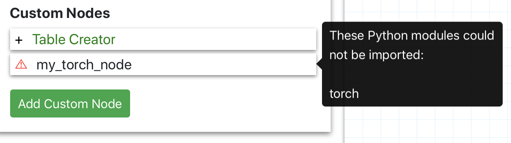

# Custom Nodes
The power of PyWorkflow comes from its support for custom nodes. New data
science and other Python packages are being constantly developed. With custom
nodes, you can write workflows tailored to your specific needs and packages
needed for your specific field.

Custom nodes were designed to be easily written and greatly expandable. You
don't need to worry about React, Django, or any specifics of PyWorkflow to get
started. All you need is:

1) Create a `.py` file that subclass the main Node class.
2) Add any parameters you need for your node might need for execution.
3) Write an `execute()` method using your package of choice.
4) That's it!

The rest is handled for you, from flow variable overrides, to input data from
other nodes in the workflow. 

# Getting started
A custom node will look something like the following.
```python
from pyworkflow.node import Node, NodeException
from pyworkflow.parameters import *
import pandas as pd


class MyCustomNode(Node):
    name = "My Node Name"
    num_in = 1
    num_out = 1
    
    OPTIONS = {
        "input": StringParameter(
            "My Input Parameter",
            default="",
            docstring="A place to provide input"
        )   
    }

    def execute(self, predecessor_data, flow_vars):
        try:
            # Do custom node operations here
            my_json_data = {"message": flow_vars["input"].get_value()}
            return my_json_data
        except Exception as e:
            raise NodeException('my_node', str(e))
```

Let's break it down to see how you can take this example and make your own
custom node!

## Imports
All custom nodes require a few classes defined by the PyWorkflow package. In the
example above, we import `Node`, `NodeException`, and all (`*`) classes from
the `parameters.py` file. If you take a look at `pyworkflow/node.py`, you'll see
there's several subclasses defined in addition to `Node`. These classes are
described in their docstring comments and include:
- FlowNode: for flow variable parameter overrides
- IONode: for reading/writing data
- ManipulationNode: for altering data
- VizNode: for visualizing data with graphs, charts, etc.

In the example above, we subclass the main `Node` class, but you can also
import/subclass one of the others mentioned above depending on your use case.

The final line, `import pandas as pd` is important as all PyWorkflow nodes use
a pandas DataFrame as the atom of data representation. If your custom node
reads or writes data, it must start or end with a pandas DataFrame.

## Class attributes
You'll see there are three class-level attributes defined in the example above.
This information is used by both the front- and back-ends to properly display
and validate your custom node. The attributes are:
- `name`: The display name you want your node to have in the UI.
- `num_in`: The number of 'in' ports your node accepts.
- `num_out`: The number of 'out' ports your node accepts.

## Parameter options
The next part of the example is the `OPTIONS` dictionary that defines any number
of parameters your custom node might need for execution. You can find out more
about the different parameter types in `pyworkflow/parameters.py`, but for a
general overview, there is:
- `FileParameter`: accepts a file-upload in the configuration form
- `StringParameter`: accepts any string input, displayed as `<input type="text">`
- `TextParameter`: accepts any string input, but displayed as an HTML `<textarea>`
- `IntegerParameter`: accepts an integer number input, displayed as `<input type="number">`
- `BooleanParameter`: true or false, displayed as `<input type="checkbox">`
- `SelectParameter`: a dropdown form input

Parameter options are... optional. Your node might not need them for execution,
but if it does, it can accept any input type listed above.

## The `execute()` method
This is the bread-and-butter of custom nodes and where the real power lies. Here
is where you can take full advantage of whatever Python package and function
your workflow requires. Whether that is *pandas*, *numpy*, or something else,
here is where you can perform operations using that package.

Let's look at the method definition a little more closely.
```python
def execute(self, predecessor_data, flow_vars):
``` 

The `execute()` method is specified by the parent Node class, and if not
included in your custom node, will raise a `NotImplementedError`.

`self` refers to the specific Node instance that is being executed. Most of the
time, this will not be needed. However, if you need the name or ID of the node,
you can access that information by `self.<attribute_name>`.

`predecessor_data` is a Python list that stores preceding Node data converted
to Python dictionaries. For example, if a Node has two input ports, you could
convert this data back to pandas DataFrames with the following two lines
```
first_df = pd.DataFrame.from_dict(predecessor_data[0])
second_df = pd.DataFrame.from_dict(predecessor_data[1])
```

Finally, `flow_vars` is a Python dictionary similar to the `OPTIONS` defined
above. If no flow variables have been specified in your workflow, `flow_vars`
will be exactly the same as `OPTIONS`. If you have any overridden parameters
however, `flow_vars` will contain the values of these flow variables. The
example above demonstrates this
```python
flow_vars["input"].get_value()
```
will retrieve the value passed in to the "input" parameter in the configuration
form, either manually by the user, or through a flow variable.

## Writing your execution

If you are not sure where to start, the easiest thing to do might be to look at
the pre-built nodes included with PyWorkflow. These can be found in
`pyworkflow/nodes` and demonstrate how to translate a specific pandas function
into a Node class.

After reading through an example, visit the
[pandas documentation](https://pandas.pydata.org/docs/) and find your favorite
method you want to translate to a node. At the core of each execution method is
code that looks something like
```python
df = pd.pandas_method_here(arg1, arg2)
return df.to_json()
```
Just remember to return the data from your execution as JSON data. This is
easily done with pandas DataFrames with [`df.to_json()`](https://pandas.pydata.org/pandas-docs/stable/reference/api/pandas.DataFrame.to_json.html).

## Additional packages

The example provided above is very simple, but gives you an idea on how you
can write your own custom node utilizing pandas library functions and
DataFrames. If your workflow requires additional packages, it can support those
too with a little extra work!

Let's say you want to write a machine-learning node with the PyTorch package.
We just want to write a simple node based on the [PyTorch getting started
example](https://pytorch.org/get-started/locally/). We would first need to
import PyTorch by
```python
import torch
```
and then in our execute method we could write a line of code like
```python
x = torch.rand(5, 3)
```

That's it! Except, if you take a look at the custom node list in the UI, you
will be greeted with an error that looks something like



This is because, if you try to use a package like PyTorch that is not installed
in PyWorkflow's `Pipfile`, your custom node won't know how to use the package.
All you have to do is install the package in PyWorkflow and you'll be good to
go!

**Running locally**:
```
# Go to wherever the back-end code is located
cd visual-programming/back-end

# Install the package
pipenv install [package-name]
```

If you restart the server and take a look, the error message should no longer
appear and you can go about using your custom node with additional packages!